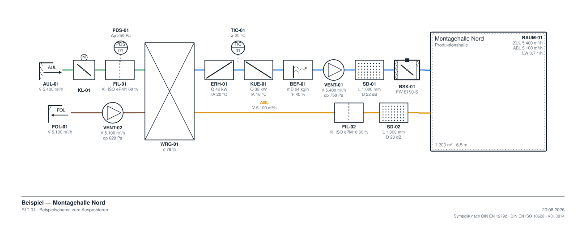

# RLT-Schema

Zeichenwerkzeug für raumlufttechnische Anlagen. Symbole werden per Drag-and-drop
auf eine unbegrenzte Zeichenfläche gezogen, über Anschlusspunkte zu Kanälen
verbunden und mit fachlichen Parametern versehen. Bedienung und Darstellung sind
auf das iPad ausgelegt; die App läuft als Web-App auf GitHub Pages und nach dem
ersten Laden vollständig offline.



## Was das Werkzeug kann

- **115 Normsymbole** in neun Kategorien — Luftbehandlung, Wärmerückgewinnung,
  Klappen und Brandschutz, Kanal und Formteile, Luftdurchlässe, MSR und Sensorik,
  Wasser- und Kältekreis, Erzeuger sowie Räume und Beschriftung.
- **Umschaltbarer Umfang der Bibliothek** — *Reduziert* (27 Symbole) zeigt nur die
  Bauteile eines RLT-Zentralgeräts, Durchlässe, Grundfühler und Räume; *Mittel*
  (73) ergänzt Bauartvarianten, Kanalformteile, Brandschutz, MSR und Erzeuger;
  *Groß* zeigt den vollständigen Katalog. Die Einstellung wirkt nur auf die
  Palette — bereits gezeichnete Bauteile bleiben unabhängig davon erhalten und
  bearbeitbar. Führt eine Suche auf ein Symbol außerhalb des gewählten Umfangs,
  weist die Palette darauf hin und bietet das Umschalten an.
- **Nutzungseinheiten** als eigener, frei skalierbarer Symboltyp: Der versorgte
  Raum steht mit im Schema und trägt seine Auslegungsdaten — Fläche, Höhe,
  Personenzahl, Zu- und Abluftmenge, Sollwerte, Druckhaltung, Raumluftqualität.
  Volumen, Luftwechselrate, Luftbilanz und Außenluft je Person werden daraus
  berechnet.
- **Kanäle mit Anschlusspunkten**: Von einem Anschluss zum nächsten ziehen legt
  eine orthogonal geführte Leitung, die beim Verschieben der Bauteile mitwandert.
  Der Mittelknick lässt sich versetzen.
- **Strang-Modus**: Ein Bauteil, das nahe an den freien Ausgang eines anderen
  gezogen wird, rastet ein und verbindet sich selbst — so entsteht ein
  Zentralgerät in wenigen Handgriffen.
- **Luftarten mit Farbcode** — Außenluft grün, Zuluft blau, Abluft gelb, Fortluft
  braun, Umluft orange; umschaltbar auf einfarbig Schwarz für den Druck.
- **Parameter je Bauteil** mit Einheiten, Auswahllisten und Normbezug. Pro Feld
  ein Schalter, ob der Wert als Beschriftung am Symbol erscheint.
- **Stückliste**, nach Kategorie gruppiert, live aktualisiert, optional als Block
  unter dem Schema und als CSV.
- **Export** als PNG (ein- bis dreifache Auflösung), SVG, Projekt-JSON und CSV —
  auf dem iPad über den Teilen-Dialog, sonst als Download.
- **Projekte** liegen im Gerät (IndexedDB) mit Vorschaubild und Auto-Speichern.

## Normbezug

| Bereich | Regelwerk |
| --- | --- |
| Graphische Symbole Lüftung | DIN EN 12792 |
| Fließschemata | DIN EN ISO 10628, DIN EN ISO 14617 |
| Luftarten und Auslegung | DIN EN 16798-1, DIN EN 16798-3 |
| Filterklassen | DIN EN ISO 16890, DIN EN 1822 |
| MSR- und GA-Symbole | VDI 3814, DIN EN ISO 16484-3 |
| Klappen und Brandschutz | DIN EN 1751, DIN EN 15650, DIN EN 12101 |
| Kanaldichtheit | DIN EN 12237, DIN EN 1507 |
| Hygiene | VDI 6022, DIN 1946-4 |

## Bedienung

| Geste | Wirkung |
| --- | --- |
| Ein Finger auf freier Fläche | Ausschnitt verschieben |
| Zwei Finger | Verschieben und zoomen |
| Ein Finger auf einem Bauteil | Bauteil verschieben |
| Ziehen von einem Anschlusspunkt | Leitung legen |
| Symbol in der Palette antippen, dann auf die Fläche tippen | Bauteil setzen |
| Symbol aus der Palette herüberziehen | Bauteil setzen |
| In der Palette senkrecht wischen | Symbolliste blättern |
| Apple Pencil auf freier Fläche | Auswahlrahmen aufziehen |

In der Palette entscheidet die Richtung: senkrecht wischen blättert die Liste,
waagerecht oder schräg ziehen nimmt ein Symbol mit. Antippen merkt es zum
Platzieren vor.

Am Schreibtisch zusätzlich: `Entf` löscht, `Strg+Z` / `Strg+Umschalt+Z` für
Rückgängig und Wiederherstellen, `Strg+D` dupliziert, `R` dreht, `H` spiegelt,
`Esc` hebt die Auswahl auf. Mausrad verschiebt, `Strg` + Mausrad zoomt.

## Entwicklung

```bash
npm install
npm run dev
```

| Befehl | Zweck |
| --- | --- |
| `npm run dev` | Entwicklungsserver |
| `npm test` | Testlauf (Katalog, Kanalführung, Dokument, Export) |
| `npm run build` | Typprüfung und Produktionsbundle nach `dist/` |
| `npm run icons` | App-Icons neu erzeugen |
| `npm run vorschau` | Beispielschemata nach `docs/vorschau/` rendern |

### Aufbau

```
src/
  catalog/   Symbolkatalog: Geometrie, Anschlusspunkte, Parameterschema
  state/     Dokumentmodell, Zustandsverwaltung, Kennzeichen, Rückgängig
  canvas/    Zeichenfläche, Symboldarstellung, Kanalführung, Gesten
  ui/        Werkzeugleiste, Palette, Eigenschaften, Stückliste, Projekte, Export
  export/    SVG-Erzeugung, PNG, CSV, Projektdatei
  storage/   IndexedDB
```

Die Symbolkomponenten aus `catalog` werden sowohl von der Zeichenfläche als auch
vom SVG-Export gerendert. Ein Symbol ist damit einmal definiert und kann zwischen
Anzeige und Ausgabe nicht auseinanderlaufen.

**Den Umfang einer Stufe ändern**: die Listen in `src/catalog/umfang.ts`
anpassen. `REDUZIERT` enthält den Kernbestand, `MITTEL_ZUSATZ` was der mittlere
Satz darüber hinaus anbietet; die volle Stufe umfasst immer den ganzen Katalog.
Die Tests prüfen, dass jede genannte Kennung existiert und die Stufen
aufeinander aufbauen.

**Ein Symbol ergänzen**: einen Eintrag in der passenden Datei unter
`src/catalog/symbols/` anlegen — Kennung, Bezeichnung, Kategorie,
Kennzeichen-Präfix, Abmessung, Anschlusspunkte, Parameterschema und
Zeichenfunktion. Palette, Eigenschaftenfenster, Stückliste und Export ziehen
automatisch nach.

**Wichtig für gespeicherte Projekte**: Symbolkennungen (`id`) und
Parameterschlüssel (`key`) sind ASCII und ändern sich nicht — sie stehen so in
den Projektdateien. Anzeigetexte werden mit echten Umlauten geschrieben.

## Veröffentlichen

Ein Push auf `main` baut und veröffentlicht die App über GitHub Actions auf
GitHub Pages (`.github/workflows/deploy.yml`). In den Repository-Einstellungen
unter *Pages* muss als Quelle **GitHub Actions** eingestellt sein. Der Basispfad
wird beim Bauen aus dem Repository-Namen abgeleitet.

Auf dem iPad die veröffentlichte Adresse in Safari öffnen, über *Teilen* →
*Zum Home-Bildschirm* ablegen. Danach startet das Werkzeug im Vollbild und läuft
ohne Netzverbindung.

### Wie Aktualisierungen ankommen

Der Seitenaufruf geht zuerst ans Netz und erst bei fehlender Verbindung an den
Offline-Vorrat. Eine neu veröffentlichte Fassung ist damit beim nächsten Start
da, ohne dass das Symbol vom Home-Bildschirm entfernt werden muss. Läuft die App
gerade, meldet sie sich mit einem Hinweis und lädt auf Wunsch sofort neu; beim
Zurückholen in den Vordergrund sieht sie zusätzlich selbst nach.

Damit das trägt, darf der Seitenaufruf im Service Worker nicht aus dem Vorrat
beantwortet werden: die gespeicherte `index.html` verweist auf Dateinamen mit
Prüfsumme und würde die App sonst dauerhaft auf dem installierten Stand
festhalten.
